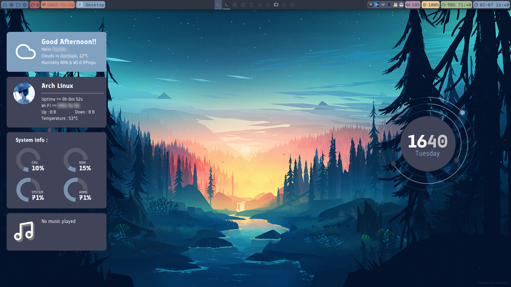

# My Dotfiles

```plaintext
config/*     -> ~/.config/*
local/*      -> ~/.local/*
clang-format -> ~/.clang-format
zimrc        -> ~/.zimrc         # Not sure how it works
zshrc        -> ~/.zshrc
```

## Screenshot



## Installation

```bash
git clone https://github.com/Fr4nk1in-USTC/dotfiles.git
cd dotfiles

# Copy the configuration files you need.
cp -r config/* ~/.config/
cp -r local/* ~/.local/

# --------------------------------
# BE CAREFUL ABOUT FOLLOWING STEPS
# --------------------------------
# cp zshrc ~/.zshrc # Do you need it?
# cp zimrc ~/.zimrc # You should copy it after installing the Zimfw.
```
